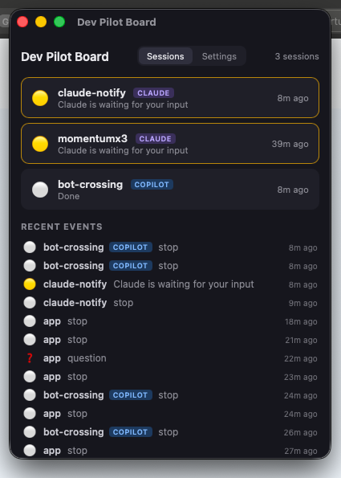
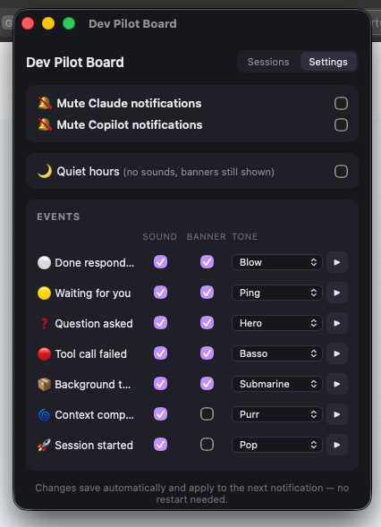

# Dev Pilot Board

A menu-bar status board for your AI coding agents. Watches **Claude Code** and **GitHub
Copilot CLI** sessions and tells you — with per-event sounds, native banners, and a
tray glyph — what each agent is doing and when one is blocked waiting on you.

> **Works with the terminal (CLI) tools**: [Claude Code](https://claude.com/claude-code)
> and [GitHub Copilot CLI](https://docs.github.com/en/copilot/how-tos/copilot-cli) —
> the agents you run in your terminal. It hooks into their lifecycle-event systems, so
> IDE extensions (VS Code Copilot pane, etc.) and web chats are **not** covered.

| Sessions | Settings |
|:---:|:---:|
|  |  |

- ❓ an agent asked you a question
- 🟡 waiting for permission / input (banner shows the actual prompt)
- 🟢 working
- ⚪ done

Full product spec: [docs/requirements.md](docs/requirements.md)

## How it works

Both tools' hook systems call one shell script; the app and the script talk through files:

```
Claude Code hooks ─┐
                   ├─> notify.sh ──┬─> sound + native banner (per-tool logo)
Copilot CLI hooks ─┘               └─> ~/.claude/notify-state.jsonl
                                              │ polled every 2s
                                     Dev Pilot Board (Tauri 2 + Vue 3)
                                       settings ──> ~/.claude/notify-config.json ──> notify.sh
```

No sockets, no daemons: either side keeps working if the other is absent.

## Requirements

- macOS (Apple Silicon or Intel) — the app itself is cross-platform; notification
  delivery is currently macOS-only
- `jq` (`brew install jq`)
- Optional: `terminal-notifier` (`brew install terminal-notifier`) for logo banners
- For building: Node 20+, Rust stable

## Setup

### 1. Hook script

Clone the repo and note the absolute path of `notify.sh` (must be executable).

### 2. Claude Code hooks

Register the events in `~/.claude/settings.json` (adjust the path):

```json
{
  "hooks": {
    "Stop":               [{ "hooks": [{ "type": "command", "command": "/path/to/notify.sh stop",          "async": true, "timeout": 10 }] }],
    "Notification":       [{ "hooks": [{ "type": "command", "command": "/path/to/notify.sh waiting",       "async": true, "timeout": 10 }] }],
    "PreToolUse":         [{ "matcher": "AskUserQuestion", "hooks": [{ "type": "command", "command": "/path/to/notify.sh question", "async": true, "timeout": 10 }] }],
    "PostToolUseFailure": [{ "hooks": [{ "type": "command", "command": "/path/to/notify.sh failure",       "async": true, "timeout": 10 }] }],
    "TaskCompleted":      [{ "hooks": [{ "type": "command", "command": "/path/to/notify.sh task-done",     "async": true, "timeout": 10 }] }],
    "PreCompact":         [{ "hooks": [{ "type": "command", "command": "/path/to/notify.sh compact",       "async": true, "timeout": 10 }] }],
    "SessionStart":       [{ "hooks": [{ "type": "command", "command": "/path/to/notify.sh session-start", "async": true, "timeout": 10 }] }],
    "UserPromptSubmit":   [{ "hooks": [{ "type": "command", "command": "/path/to/notify.sh working",       "async": true, "timeout": 10 }] }],
    "SessionEnd":         [{ "hooks": [{ "type": "command", "command": "/path/to/notify.sh session-end",   "async": true, "timeout": 10 }] }]
  }
}
```

### 3. Copilot CLI hooks

Create `~/.copilot/hooks/notify.json` mapping Copilot's events to the same script with a
`copilot` source argument — see the example in
[docs/requirements.md §3.1](docs/requirements.md) (events: sessionStart, sessionEnd,
userPromptSubmitted, agentStop, postToolUseFailure, preCompact, notification).

### 4. Banner logos (optional)

```bash
mkdir -p ~/.claude/notify-icons
curl -sL "https://www.google.com/s2/favicons?domain=claude.ai&sz=128"  -o ~/.claude/notify-icons/claude.png
curl -sL "https://www.google.com/s2/favicons?domain=github.com&sz=128" -o ~/.claude/notify-icons/copilot.png
```

### 5. The app

```bash
cd app
npm install
npm run tauri dev          # development
npm run tauri build        # release bundle (.app + .dmg under src-tauri/target/)
```

> Unsigned test builds: after copying the app from the DMG, clear quarantine once:
> `xattr -d com.apple.quarantine "/Applications/Dev Pilot Board.app"`

## Using it

- The tray icon shows a glyph for the most urgent state: `?` question, `!` waiting,
  `…` working. Left-click toggles the dashboard; right-click → Open Dashboard / Quit.
- **Settings tab**: per-source mute (Claude / Copilot), quiet hours, and per-event
  sound/banner toggles with tone picker + preview. Changes apply to the next
  notification — no restart.
- Sound override without the app: `CLAUDE_NOTIFY_SOUND_<EVENT>` env vars
  (e.g. `CLAUDE_NOTIFY_SOUND_QUESTION=Funk`).

## Repository layout

```
notify.sh              # hook target for both tools (delivery + state log)
app/                   # Tauri 2 + Vue 3 desktop app
  src/App.vue          #   dashboard
  src/Settings.vue     #   settings panel
  src-tauri/           #   Rust shell (tray, window, commands)
  assets/              #   icon sources (SVG)
docs/requirements.md   # product requirements
AGENTS.md              # guidance for AI coding agents working on this repo
```

## License

[MIT](LICENSE)
